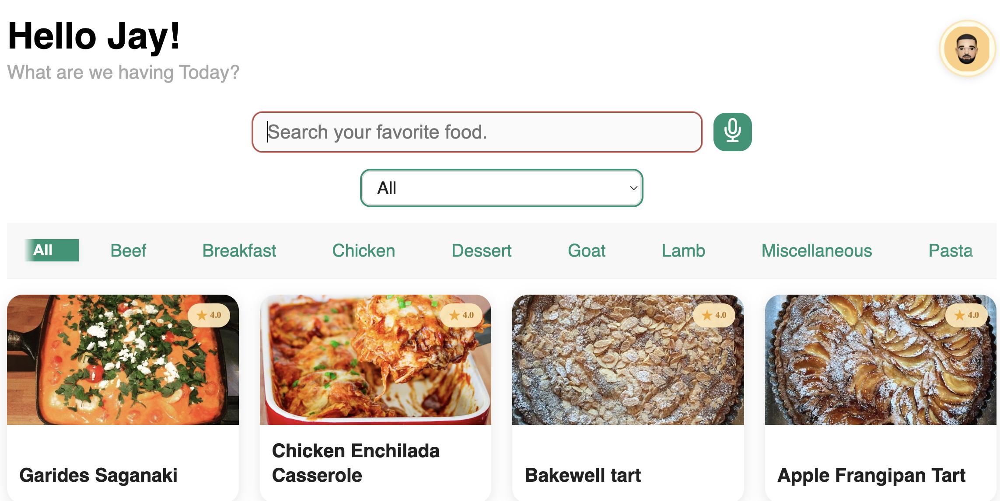
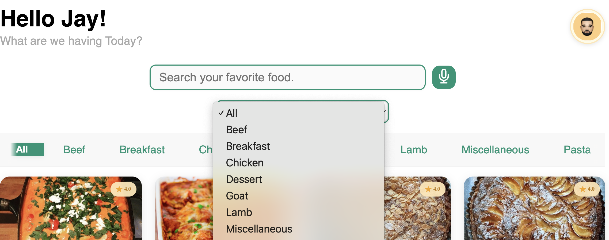
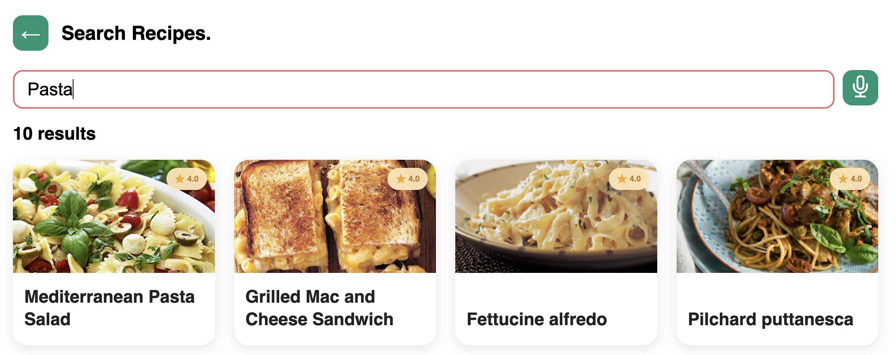
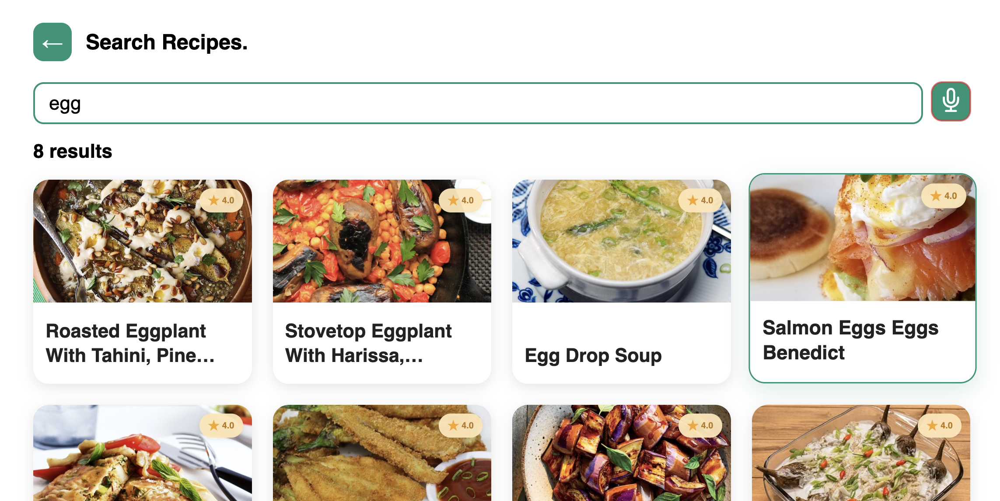
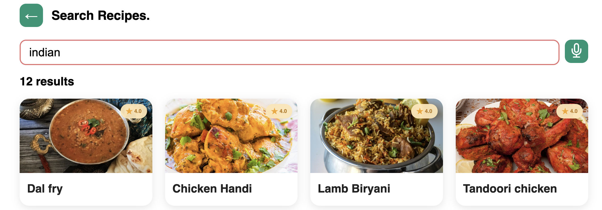

# Food Recipe App

[Live Demo →](https://foodrecipes-mealdb.web.app)

This is a responsive web-application based on the mealDB API.
Users can voice-search a recipe by ingredient in the image, name and the category of the food-item. I implemented the voice-search using the speech-recognition API from npm react team. While basic react state-hooks and javascript mapping code was written for fetching and connecting APIs with the UI logics. 
Hope you have fun exploring the project! :)

---

## 📸 Demo / Screenshot

- 
  - _Home Screen displaying all available recipes across categories._
- 
  - _Home Screen filtered to the "Miscellaneous" category, showing category-based filtering._
- 
  - _Search Screen with results filtered by a specific ingredient._
- 
  - _Search Screen with results filtered by a type or category._
- 
  - _Another view of the Search Screen focused on searching by ingredient._
- 
  - _Search Screen with results filtered by region or area._

---

## 📑 Table of Contents

- [Features](#features)
- [API Endpoints](#api-endpoints)
- [Tech Stack](#tech-stack)
- [Installation & Setup](#installation--setup)
- [Running Locally](#running-locally)
- [Building for Production](#building-for-production)
- [Deployment](#deployment)
- [Usage](#usage)
- [Project Structure](#project-structure)
- [Bonus: Voice Assistant](#bonus-voice-assistant)
- [Testing](#testing)
- [Contributing](#contributing)
- [License](#license)

---

## ✨ Features

- **Browse All Recipes:**
  - View a grid of all available food items with images and details.
- **Filter by Category:**
  - Select from a dropdown or tab to filter recipes by category (e.g., Seafood, Vegetarian, Pasta).
- **Search by Name:**
  - Instantly search for recipes by typing in the search bar.
- **Bonus: Voice Assistant**
  - Use the microphone button to search recipes by voice (Chrome/Safari supported).
- **Responsive UI:**
  - Mobile-friendly, animated, and visually aligned with Figma.

---

## 🔗 API Endpoints

- **Search by Name:**
  - `GET https://www.themealdb.com/api/json/v1/1/search.php?s=Arrabiata`
- **Filter by Category:**
  - `GET https://www.themealdb.com/api/json/v1/1/filter.php?c=Seafood`
- **List All Categories:**
  - `GET https://www.themealdb.com/api/json/v1/1/list.php?c=list`
- **Other Used Endpoints:**
  - Filter by ingredient, area, and get full meal details as needed.

---

## 🛠 Tech Stack

- **Frontend:** React 19, React Router
- **Styling:** CSS Modules, custom animations
- **Voice:** [react-speech-recognition](https://www.npmjs.com/package/react-speech-recognition)
- **APIs:** [TheMealDB](https://www.themealdb.com/api.php)
- **Deployment:** Firebase Hosting

---

## ⚙️ Installation & Setup

### Prerequisites
- Node.js (v18+ recommended)
- npm

### Setup
```bash
cd food-recipe
npm install
```

---

## ▶️ Running Locally
```bash
npm start
```
App will be available at [http://localhost:3000](http://localhost:3000)

---

## 🏗 Building for Production
```bash
npm run build
```
Builds the app for production to the `build/` folder.

---

## 🚀 Deployment

This project is deployed using **Firebase Hosting**. To deploy your own:

1. Install Firebase CLI:
   ```bash
   npm install -g firebase-tools
   ```
2. Login and initialize (if not already):
   ```bash
   firebase login
   firebase init hosting
   ```
3. Deploy:
   ```bash
   npm run build
   firebase deploy
   ```

Or use the provided GitHub Actions workflow for automatic deployment on push to `main`.

---

## 🧑‍💻 Usage

- **Browse:**
  - Home page shows all recipes. Scroll or use category tabs/dropdown.
- **Filter:**
  - Select a category to filter recipes.
- **Search:**
  - Type in the search bar to find recipes by name, ingredient, or tag.
- **Voice Search:**
  - Click the mic button and speak your query. (Supported in Chrome/Safari)
- **View Details:**
  - (Planned) Click a recipe card to view full details, instructions, and video.

---

## 📁 Project Structure

```
food-recipe/
  ├── public/
  ├── src/
  │   ├── assets/           # Images and static assets
  │   ├── components/       # Reusable UI components (Header, MealCard)
  │   ├── network/          # API functions
  │   ├── pages/            # Main screens (HomeScreen, SearchScreen, DetailScreen)
  │   ├── styles/           # CSS files
  │   ├── voiceassistant/   # Voice search logic
  │   ├── App.js            # App entry point
  │   └── index.js          # React root
  ├── .github/workflows/    # GitHub Actions workflows
  ├── package.json
  └── README.md
```

---

## 🎤 Bonus: Voice Assistant

- Powered by [react-speech-recognition](https://www.npmjs.com/package/react-speech-recognition)
- Click the mic button to start voice search
- Visual feedback when listening (button glows/pulses)
- Works best in Chrome/Safari

---

## 🤝 Contributing

Pull requests are welcome! For major changes, please open an issue first to discuss what you would like to change.

---

## 📝 License

This project is licensed under the MIT License. 